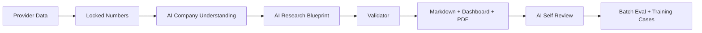

# OpenBB Company Research Tool v5.0
# Rust-Powered AI-Led Company Research Engine

Rust 驱动、AI 主导的公司研究引擎。

## English Product Overview

OpenBB Company Research Tool v5.0 is an AI-led company research engine. It helps users understand what a company is, how it makes money, where cash comes from and goes, what the locked data can support, and what still needs manual verification.

The system is not a stock picker. It does not give buy/sell/hold recommendations, target prices, or short-term trading signals.

### Why v5 Exists

Earlier automated reports could look polished while choosing the wrong company frame too early. v5 changes the order of authority:

```text
Earlier Python workflows: Data -> Rule-based profile -> Template report -> AI patch
v5 Rust workflow: Data -> Locked numbers -> AI company understanding -> AI research blueprint -> Validator -> Report -> AI self-review -> Batch eval
```

The core rule is simple: understand the company before writing the report.

### v5 Architecture



### Responsibility Split

| Layer | Responsibility |
|---|---|
| Rust | CLI, pipeline orchestration, cache, validation, batch runner, report/dashboard rendering, pack builder |
| Python | OpenBB provider, AKShare provider, Tushare provider, Baostock provider |
| AI | company understanding, financial interpretation, money flow, research blueprint, self-review, chart/table explanation |
| Validator | locked-data boundary, unsupported claims, forbidden advice, visual lint, content quality gate |

Templates only structure the surface. They do not decide the thesis, company identity, valuation frame, or risks.

## 中文产品说明

OpenBB Company Research Tool v5.0 是一个 AI 主导的公司研究引擎。它帮助用户理解：公司是什么、靠什么赚钱、钱从哪里来又去了哪里、当前数据能支持什么判断、还有哪些内容必须人工核查。

它不是荐股系统，不提供买入、卖出、持有建议，不给目标价，也不预测短期股价。

### 为什么需要 v5

旧版自动报告最大的问题不是格式，而是太早套框架。公司还没认清，报告已经开始写。v5 的核心变化是把 AI 的公司理解前置：

```text
旧 Python 流程：数据 -> 规则分类 -> 模板报告 -> AI 补丁
v5 Rust 流程：数据 -> 锁定数字 -> AI 理解公司 -> AI 研究蓝图 -> Validator -> 报告 -> AI 自检 -> 批量评估
```

一句话：先认清公司，再写报告。

### v5 分工

| 层 | 负责什么 |
|---|---|
| Rust | CLI、流程编排、缓存、校验、批量、报告/dashboard 渲染、打包 |
| Python | OpenBB、AKShare、Tushare、Baostock 数据适配 |
| AI | 公司理解、财报解释、资金流、研究蓝图、自我复核、图表/表格解释 |
| Validator | 锁定数据边界、unsupported claims、禁止投资建议、visual lint、内容质量闸门 |

模板只负责展示格式，不负责判断公司是什么，也不负责生成结论。

## Quick Start

Primary entry point: `research-rs`.

```bash
source "$HOME/.cargo/env"
cd research-rs
cargo run -p research-rs -- --help
```

Run AAPL with local fallback analysis:

```bash
cargo run -p research-rs -- run AAPL --ai local --run-id demo_aapl_local
```

Run AAPL with a real OpenAI API call:

```bash
OPENAI_API_KEY="your_key" cargo run -p research-rs -- run AAPL \
  --ai compact \
  --require-external-ai \
  --no-ai-cache \
  --run-id demo_aapl_external
```

Run a China A-share company:

```bash
cargo run -p research-rs -- run 600519.SH \
  --market cn \
  --provider akshare \
  --ai local \
  --run-id demo_600519
```

Run the broad 30 probe:

```bash
cargo run -p research-rs -- batch ../eval_sets/broad_30_probe.yaml \
  --mode batch \
  --workers 2 \
  --ai local \
  --run-id demo_broad_30
```

## How to Verify Real OpenAI API Usage

Do not infer AI usage from polished writing. Check the run artifact:

```text
reports/TICKER/runs/RUN_ID/metadata/ai_usage.json
```

Required fields:

- `external_ai_used`
- `local_mock_used`
- `new_external_ai_calls`
- `cache_hits`
- `model`
- `tasks`

Example from a real external run:

```json
{
  "external_ai_used": true,
  "local_mock_used": false,
  "new_external_ai_calls": 4,
  "cache_hits": 0,
  "model": "gpt-4.1-mini"
}
```

If `external_ai_used=false`, the output is not a full external OpenAI analysis. It may be local fallback, skipped AI, or cache-only output. Reports and dashboards must surface that boundary.

## Supported Markets

| Market | Providers | Ticker examples | Notes |
|---|---|---|---|
| US / Global | OpenBB bridge, optional fallback | `AAPL`, `GOOGL`, `CAT`, `AMD` | Coverage depends on local provider availability. |
| China A-share | AKShare first, Tushare if `TUSHARE_TOKEN` exists, Baostock fallback | `600519.SH`, `000001.SZ`, `300750.SZ` | A-share fields can be incomplete; reports must downgrade honestly. |

## Output Structure

```text
reports/AAPL/runs/RUN_ID/
  README.md
  report/
    AAPL_research_report.md
    AAPL_research_report_cn.md
    AAPL_research_report.pdf
  dashboard.html
  raw/
    provider_payload.json
  metadata/
    company_understanding.json
    financial_interpretation.json
    research_blueprint.json
    ai_usage.json
    evidence_map.json
    product_quality_score.json
    report_status.json
  ai/
    prompts/
    responses/
    cache_info.json
  audit/
    validator_report.md
    visual_lint_report.md
    data_inventory_report.md
    chart_table_quality_report.md
  self_review/
    ai_self_review.json
    ai_self_review.md
  charts/
  pack/
```

Start with the Markdown report, then inspect `dashboard.html`, `metadata/ai_usage.json`, `metadata/research_blueprint.json`, `self_review/ai_self_review.md`, and `audit/validator_report.md`.

## Report Sections

1. Report Status
2. Company Identity
3. Business Model
4. Money Flow
5. Financial Statement Interpretation
6. AI Research Blueprint
7. Valuation Frame
8. Risks and Red Flags
9. Data Gaps
10. AI Self Review
11. Next Checks
12. Appendix: Locked Data

## v5 Sample Gallery

Samples are checked in under `reports/samples/`. They are product-surface examples, not investment recommendations. Always inspect `metadata/ai_usage.json` to see whether the sample used external OpenAI or local fallback.

| Company | Market | AI Source Label | Report | Dashboard | AI Usage | Company Understanding | Blueprint | Self Review |
|---|---|---|---|---|---|---|---|---|
| AAPL | US | local fallback sample | [report](reports/samples/AAPL/report/AAPL_research_report.md) | [dashboard](reports/samples/AAPL/dashboard.html) | [ai_usage](reports/samples/AAPL/metadata/ai_usage.json) | [company_understanding](reports/samples/AAPL/metadata/company_understanding.json) | [blueprint](reports/samples/AAPL/metadata/research_blueprint.json) | [self_review](reports/samples/AAPL/self_review/ai_self_review.md) |
| GOOGL | US | local fallback sample | [report](reports/samples/GOOGL/report/GOOGL_research_report.md) | [dashboard](reports/samples/GOOGL/dashboard.html) | [ai_usage](reports/samples/GOOGL/metadata/ai_usage.json) | [company_understanding](reports/samples/GOOGL/metadata/company_understanding.json) | [blueprint](reports/samples/GOOGL/metadata/research_blueprint.json) | [self_review](reports/samples/GOOGL/self_review/ai_self_review.md) |
| CAT | US | local fallback sample | [report](reports/samples/CAT/report/CAT_research_report.md) | [dashboard](reports/samples/CAT/dashboard.html) | [ai_usage](reports/samples/CAT/metadata/ai_usage.json) | [company_understanding](reports/samples/CAT/metadata/company_understanding.json) | [blueprint](reports/samples/CAT/metadata/research_blueprint.json) | [self_review](reports/samples/CAT/self_review/ai_self_review.md) |
| AMD | US | local fallback sample | [report](reports/samples/AMD/report/AMD_research_report.md) | [dashboard](reports/samples/AMD/dashboard.html) | [ai_usage](reports/samples/AMD/metadata/ai_usage.json) | [company_understanding](reports/samples/AMD/metadata/company_understanding.json) | [blueprint](reports/samples/AMD/metadata/research_blueprint.json) | [self_review](reports/samples/AMD/self_review/ai_self_review.md) |
| 600519.SH | CN A-share | local fallback sample | [report](reports/samples/600519.SH/report/600519.SH_research_report.md) | [dashboard](reports/samples/600519.SH/dashboard.html) | [ai_usage](reports/samples/600519.SH/metadata/ai_usage.json) | [company_understanding](reports/samples/600519.SH/metadata/company_understanding.json) | [blueprint](reports/samples/600519.SH/metadata/research_blueprint.json) | [self_review](reports/samples/600519.SH/self_review/ai_self_review.md) |
| 000001.SZ | CN A-share | local fallback sample | [report](reports/samples/000001.SZ/report/000001.SZ_research_report.md) | [dashboard](reports/samples/000001.SZ/dashboard.html) | [ai_usage](reports/samples/000001.SZ/metadata/ai_usage.json) | [company_understanding](reports/samples/000001.SZ/metadata/company_understanding.json) | [blueprint](reports/samples/000001.SZ/metadata/research_blueprint.json) | [self_review](reports/samples/000001.SZ/self_review/ai_self_review.md) |

Generate or refresh the sample gallery index:

```bash
cargo run -p research-rs --manifest-path research-rs/Cargo.toml -- samples
open reports/samples/index.html
```

## Dashboard, PDF, and Charts

Each standard run attempts to produce:

- Markdown report
- static `dashboard.html`
- PDF export when local tooling is available
- core charts or data-gap cards
- chart explanation blocks
- table explanation blocks
- `audit/visual_lint_report.md`

The dashboard is a research surface, not a file index. It shows report status, AI source, company identity, money flow, research blueprint, data gaps, quality score, charts, and audit links.

## Content Quality Evaluation

v5 generates quality artifacts so users can check whether the report has research value:

- `metadata/product_quality_score.json`
- `metadata/evidence_map.json`
- `metadata/data_inventory.json`
- `audit/data_inventory_report.md`
- `audit/visual_lint_report.md`
- `audit/language_naturalness_report.md`
- `metadata/language_quality_score.json`
- `audit/chart_table_quality_report.md`
- `self_review/ai_self_review.md`
- batch-level `training_cases_generated.jsonl`

Quality checks are meant to catch polished but weak reports, unsupported claims, missing money-flow analysis, chart/table issues, generic AI prose, translationese, vague next checks, and local fallback boundaries.

v5 reports are designed to avoid generic AI prose. English reports should read like clear research memos. Chinese reports are not line-by-line translations of English; they are organized from the same locked data, evidence map, and research blueprint in natural Chinese.

## AI and Credit Control

v5 is designed to avoid wasting tokens:

- compact payloads instead of full raw-data dumps
- AI response cache
- `--no-ai-cache` for forced fresh calls
- `--require-external-ai` for hard external API verification
- local fallback when external AI is not required
- provenance in each AI artifact

External AI is never assumed. It must be proven by `metadata/ai_usage.json`.

## Legacy Python Workflow

Earlier v2-v4 Python workflows remain available for compatibility; see [docs/history_v2_v4.md](docs/history_v2_v4.md). Legacy commands such as `openbb-research`, `cresearch`, and `python scripts/company_research_tool.py` are not the v5 primary entry point.

## Limitations

- This is not investment advice.
- No buy/sell/hold recommendation is produced.
- No target price is produced.
- Provider coverage may be incomplete, especially across A-share fields and industry KPIs.
- AI may be wrong even when the API call succeeds.
- local/mock fallback is not full external AI analysis.
- Serious decisions require human review and independent source checks.
- PDF export depends on local tooling and may be marked unavailable or warning.

## Roadmap

| Stage | Scope |
|---|---|
| v5.0 | Rust pipeline, OpenBB + A-share provider bridge, AI-led reports, static dashboard, PDF export, visual/content lint, broad_30 validation |
| v5.1 | Streamlit internal workbench, research portfolio notebook, advanced charts |
| v5.2 | React dashboard, broader markets, real-time quote context |
| P3 deferred | real trading, broker execution, automatic order placement |

Real trading, broker execution, and automatic order placement are intentionally deferred.

## 免责声明

本项目生成的是供复核的一轮研究材料。它可以帮助整理公司理解、资金流、数据证据、风险、数据缺口和下一步核查，但不能替代尽调、审计文件、监管披露、专业建议或人的判断。

## Disclaimer

This project generates first-pass research material for review. It can help structure company understanding, money flow, evidence, risks, data gaps, and follow-up checks. It cannot replace due diligence, audited filings, regulatory disclosures, professional advice, or human judgment.
