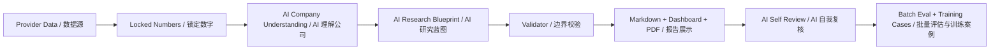

# OpenBB Company Research Tool v5.0
# Rust-Powered AI-Led Company Research Engine

**Rust 驱动、AI 主导的公司研究引擎。**

An AI-led company research engine that helps users understand what a company is, how it makes money, where cash comes from and goes, what the data supports, and what still needs manual verification.

一个 AI 主导的公司研究引擎，帮助用户理解公司是什么、靠什么赚钱、钱从哪里来去了哪里、数据能支持什么、还有什么必须人工核查。

This is not an investment-advice system. It does not issue buy/sell/hold recommendations, target prices, or short-term trading signals.

本项目不是投资建议系统，不给买入/卖出/持有建议，不给目标价，也不做短线交易信号。

## What Changed in v5.0 / v5.0 核心变化

The old workflow wrote too early:

```text
v4.x: Data -> Rule-based profile -> Template report -> AI patch
```

v5.0 reverses the order. The system locks data first, asks AI to understand the company before writing, validates boundaries, then renders the report:

```text
v5.0: Data -> Locked numbers -> AI company understanding -> AI research blueprint -> Validator -> Report -> AI self-review -> Batch eval
```

旧流程最大问题是还没认清公司就开始套模板。v5.0 的核心是：先锁定数字，再让 AI 理解公司、生成研究蓝图和资金流解释，最后由 Validator 限制事实边界并生成报告。



## Responsibility Split / 责任分工

Responsibility map:

| Layer | Owns | 中文说明 |
|---|---|---|
| Rust | CLI, pipeline, cache, validation, batch, report/dashboard rendering, pack | Rust 管工程控制面、缓存、校验、批量和展示输出 |
| Python | OpenBB, AKShare, Tushare, Baostock provider adapters | Python 管财经数据生态和 provider 适配 |
| AI | company understanding, financial interpretation, money flow, research blueprint, self-review, chart/table explanation | AI 负责公司理解、财报解释、资金流、研究蓝图和自检 |
| Validator | locked data boundary, unsupported claims, forbidden advice, visual lint, quality gate | Validator 负责事实边界、禁用投资建议、视觉 lint 和质量闸门 |

Templates only structure the surface. They do not decide the thesis, company profile, valuation frame, or risks.

模板只管格式，不决定公司是什么、研究主线是什么、估值框架是什么、风险是什么。

## Supported Markets / 支持市场

| Market | Providers | Ticker examples | Notes |
|---|---|---|---|
| US / Global | OpenBB bridge, optional fallback | `AAPL`, `GOOGL`, `CAT`, `AMD` | Provider coverage can vary by environment. |
| China A-share | AKShare first, Tushare if `TUSHARE_TOKEN` exists, Baostock fallback | `600519.SH`, `000001.SZ`, `300750.SZ` | A-share support is explicit, but provider fields can be incomplete. |

A 股报告会使用 A 股语境和人民币口径；如果 provider 数据不完整，报告必须明确降级，而不是假装完整覆盖。

## Quick Start / 快速开始

Use Rust from either the repo root or `research-rs/`.

```bash
source "$HOME/.cargo/env"
cargo run -p research-rs --manifest-path research-rs/Cargo.toml -- --help
```

From `research-rs/`:

```bash
cd research-rs
cargo run -p research-rs -- --help
```

Run AAPL with local fallback analysis:

```bash
cd research-rs
cargo run -p research-rs -- run AAPL --ai local --run-id demo_aapl_local
```

Run AAPL with a real OpenAI API call:

```bash
cd research-rs
OPENAI_API_KEY="your_key" cargo run -p research-rs -- run AAPL \
  --ai compact \
  --require-external-ai \
  --no-ai-cache \
  --run-id demo_aapl_external
```

Run a China A-share company:

```bash
cd research-rs
cargo run -p research-rs -- run 600519.SH \
  --market cn \
  --provider akshare \
  --ai local \
  --run-id demo_600519
```

Batch probe:

```bash
cd research-rs
cargo run -p research-rs -- batch ../eval_sets/broad_30_probe.yaml \
  --mode batch \
  --workers 2 \
  --ai local \
  --run-id demo_broad_30
```

## How to Verify Real API Usage / 如何确认是否真实调用 API

The source of AI output is not inferred from wording. It is recorded in:

```text
reports/TICKER/runs/RUN_ID/metadata/ai_usage.json
```

Key fields:

```json
{
  "external_ai_used": true,
  "local_mock_used": false,
  "new_external_ai_calls": 4,
  "cache_hits": 0,
  "model": "gpt-4.1-mini",
  "tasks": []
}
```

If `external_ai_used=false`, the run is **not** a full external OpenAI analysis. It may be local fallback, skipped AI, or cache-only output. The report and dashboard surface this explicitly.

如果 `external_ai_used=false`，这份报告就不是完整外部 OpenAI 分析。它可能是本地 fallback、跳过 AI、或者 cache 命中。报告和 dashboard 必须把这个来源写清楚。

Useful flags:

| Flag | Meaning |
|---|---|
| `--ai off` | No AI tasks; report is marked AI skipped if AI content is required. |
| `--ai local` | Local/mock fallback only; no external API call. |
| `--ai compact` | Compact payload; may call OpenAI if `OPENAI_API_KEY` is present. |
| `--ai full` | Larger payload mode with stricter cost awareness. |
| `--require-external-ai` | Hard gate: fail if OpenAI API cannot be called. |
| `--no-ai-cache` | Force a new AI request instead of reading AI cache. |

## Example Outputs / 样例输出

Samples are checked in under `reports/samples/`. They are product-surface examples, not investment recommendations.

| Company | Market | Report | Dashboard | PDF | Company Understanding | Blueprint | AI Usage | Self Review |
|---|---|---|---|---|---|---|---|---|
| AAPL | US | [report](reports/samples/AAPL/report/AAPL_research_report.md) | [dashboard](reports/samples/AAPL/dashboard.html) | [PDF](reports/samples/AAPL/report/AAPL_research_report.pdf) | [JSON](reports/samples/AAPL/metadata/company_understanding.json) | [JSON](reports/samples/AAPL/metadata/research_blueprint.json) | [JSON](reports/samples/AAPL/metadata/ai_usage.json) | [MD](reports/samples/AAPL/self_review/ai_self_review.md) |
| GOOGL | US | [report](reports/samples/GOOGL/report/GOOGL_research_report.md) | [dashboard](reports/samples/GOOGL/dashboard.html) | [PDF](reports/samples/GOOGL/report/GOOGL_research_report.pdf) | [JSON](reports/samples/GOOGL/metadata/company_understanding.json) | [JSON](reports/samples/GOOGL/metadata/research_blueprint.json) | [JSON](reports/samples/GOOGL/metadata/ai_usage.json) | [MD](reports/samples/GOOGL/self_review/ai_self_review.md) |
| CAT | US | [report](reports/samples/CAT/report/CAT_research_report.md) | [dashboard](reports/samples/CAT/dashboard.html) | [PDF](reports/samples/CAT/report/CAT_research_report.pdf) | [JSON](reports/samples/CAT/metadata/company_understanding.json) | [JSON](reports/samples/CAT/metadata/research_blueprint.json) | [JSON](reports/samples/CAT/metadata/ai_usage.json) | [MD](reports/samples/CAT/self_review/ai_self_review.md) |
| AMD | US | [report](reports/samples/AMD/report/AMD_research_report.md) | [dashboard](reports/samples/AMD/dashboard.html) | [PDF](reports/samples/AMD/report/AMD_research_report.pdf) | [JSON](reports/samples/AMD/metadata/company_understanding.json) | [JSON](reports/samples/AMD/metadata/research_blueprint.json) | [JSON](reports/samples/AMD/metadata/ai_usage.json) | [MD](reports/samples/AMD/self_review/ai_self_review.md) |
| 600519.SH | CN A-share | [report](reports/samples/600519.SH/report/600519.SH_research_report.md) | [dashboard](reports/samples/600519.SH/dashboard.html) | [PDF](reports/samples/600519.SH/report/600519.SH_research_report.pdf) | [JSON](reports/samples/600519.SH/metadata/company_understanding.json) | [JSON](reports/samples/600519.SH/metadata/research_blueprint.json) | [JSON](reports/samples/600519.SH/metadata/ai_usage.json) | [MD](reports/samples/600519.SH/self_review/ai_self_review.md) |
| 000001.SZ | CN A-share | [report](reports/samples/000001.SZ/report/000001.SZ_research_report.md) | [dashboard](reports/samples/000001.SZ/dashboard.html) | [PDF](reports/samples/000001.SZ/report/000001.SZ_research_report.pdf) | [JSON](reports/samples/000001.SZ/metadata/company_understanding.json) | [JSON](reports/samples/000001.SZ/metadata/research_blueprint.json) | [JSON](reports/samples/000001.SZ/metadata/ai_usage.json) | [MD](reports/samples/000001.SZ/self_review/ai_self_review.md) |

Some samples are generated with local fallback and must be read as product-format examples rather than proof of external OpenAI reasoning. Always check `metadata/ai_usage.json`.

部分样例使用 local fallback 生成，它们展示的是产品格式和边界标记，不代表真实外部 OpenAI 推理。请始终查看 `metadata/ai_usage.json`。

Sample gallery:

```bash
cargo run -p research-rs --manifest-path research-rs/Cargo.toml -- samples
open reports/samples/index.html
```

## Output Structure / 输出目录

```text
reports/AAPL/runs/RUN_ID/
  README.md
  report/
    AAPL_research_report.md
    AAPL_research_report_cn.md
    AAPL_research_report.pdf
  dashboard.html
  raw/
    provider_payload.json
  metadata/
    company_understanding.json
    financial_interpretation.json
    research_blueprint.json
    ai_usage.json
    evidence_map.json
    product_quality_score.json
    report_status.json
  ai/
    prompts/
    responses/
    cache_info.json
  audit/
    validator_report.md
    visual_lint_report.md
    data_inventory_report.md
    chart_table_quality_report.md
  self_review/
    ai_self_review.json
    ai_self_review.md
  charts/
  pack/
```

Start with `report/*_research_report.md`, then open `dashboard.html`, then inspect `metadata/research_blueprint.json`, `metadata/ai_usage.json`, `self_review/ai_self_review.md`, and `audit/validator_report.md`.

建议先看 Markdown 主报告，再看 dashboard，然后检查研究蓝图、AI 来源、自检和 validator 报告。

## Report Sections / 报告章节

1. Report Status
2. Company Identity
3. Business Model
4. Money Flow
5. Financial Statement Interpretation
6. AI Research Blueprint
7. Valuation Frame
8. Risks and Red Flags
9. Data Gaps
10. AI Self Review
11. Next Checks
12. Appendix: Locked Data

中文报告使用对应中文章节，并保留同样的边界、数据来源、AI 来源和自检信息。

## Dashboard, PDF, Charts / 展示面、PDF、图表

Each standard run attempts to produce:

- Markdown report
- static `dashboard.html`
- PDF export when local tooling is available
- core charts or data-gap cards
- table explanations
- chart explanations
- `audit/visual_lint_report.md`

Dashboard is a static product surface, not a file index. It shows status, AI source, company identity, money flow, blueprint, data gaps, quality score, charts, and links to raw/audit files.

Dashboard 是产品展示面，不是文件目录页。它展示状态、AI 来源、公司身份、资金流、研究蓝图、数据缺口、质量评分、图表和审计入口。

## Content Quality System / 内容质量系统

v5.0 does more than check whether files exist. It generates quality artifacts:

- content quality score
- evidence map
- data inventory
- data usage coverage
- visual lint
- chart/table quality report
- AI self-review
- training cases for failures

These files help answer: did the report explain the company, did it explain money flow, did charts and tables serve a research question, and did unsupported claims get blocked?

这些质量文件用于回答：报告有没有讲清楚公司、有没有讲清楚钱从哪里来去了哪里、图表表格是否服务研究问题、有没有挡住无证据判断。

## AI and Credit Control / AI 与成本控制

v5.0 is designed to avoid wasting tokens:

- compact payloads instead of full raw data dumps
- AI response cache
- `--no-ai-cache` for forced fresh calls
- `--require-external-ai` for hard external API verification
- local fallback when external AI is not required
- `ai_usage.json` and provenance fields for every AI artifact

External AI is never assumed. It must be proven by `metadata/ai_usage.json`.

外部 AI 调用不能靠文案猜，必须由 `metadata/ai_usage.json` 证明。

## Limitations / 限制

- This is not investment advice.
- No buy/sell/hold recommendation is produced.
- No target price is produced.
- Provider coverage may be incomplete, especially across A-share fields and industry KPIs.
- AI may be wrong even when the API call succeeds.
- local/mock fallback is not full external AI analysis.
- Serious investment decisions require human review and independent source checks.
- PDF export depends on local tooling and may be marked unavailable or warning.

中文限制：

- 这不是投资建议。
- 不给买卖持有建议。
- 不给目标价。
- 数据源覆盖可能不完整，尤其是 A 股字段和行业专属 KPI。
- 即使真实调用外部 AI，AI 也可能判断错误。
- local/mock fallback 不是完整外部 AI 分析。
- 严肃决策必须人工复核并查原始来源。
- PDF 导出依赖本地工具，可能被标记为 unavailable 或 warning。

## Roadmap / 路线图

| Stage | Scope |
|---|---|
| v5.0 | Rust pipeline, OpenBB + A-share provider bridge, AI-led reports, static dashboard, PDF export, visual/content lint, broad_30 validation |
| v5.1 | Streamlit internal workbench, research portfolio notebook, advanced charts |
| v5.2 | React dashboard, broader markets, real-time quote context |
| P3 deferred | real trading, broker execution, automatic order placement |

真实交易、券商下单和自动交易不属于 v5.0/v5.1 范围。

## Capability Matrix / 能力边界表

| Feature | Status | Real / Fallback | Notes |
|---|---|---|---|
| Rust orchestration | Active | Real | Main v5 control plane. |
| US provider bridge | Active | Real with provider-dependent coverage | Uses Python provider adapters. |
| China A-share bridge | Active | Real/fallback depending on local dependencies | Supports `600519.SH`, `000001.SZ`, `300750.SZ` format. |
| External OpenAI API | Optional | Real only when `OPENAI_API_KEY` and flags allow | Verify through `metadata/ai_usage.json`. |
| Local analyst fallback | Active | Fallback | Clearly labeled; not external AI. |
| Static dashboard | Active | Real | Generated per run. |
| PDF export | Active | Tool-dependent | If unavailable, status must say so. |
| Batch evaluation | Active | Real | Supports staged probes and failure isolation. |
| Real trading | Deferred | Not implemented | No broker execution. |

## Disclaimer / 免责声明

This project generates first-pass research material for review. It can help structure questions, evidence, data gaps, and follow-up checks. It cannot replace due diligence, audited filings, regulatory disclosures, professional advice, or human judgment.

本项目生成的是供复核的一轮研究材料。它可以帮助整理问题、证据、数据缺口和下一步核查，但不能替代尽调、审计文件、监管披露、专业建议或人的判断。
