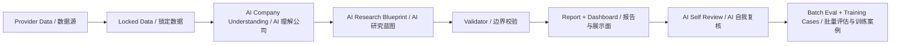

# openbb-company-research-tool

## Rust-Powered AI-Led Company Research Engine
## Rust 驱动的 AI 公司研究引擎

v5.0 introduces a new standalone Rust workspace under `research-rs/`.
The old Python workflow remains available as a fallback and reference path, but
the new engine changes the order of responsibility:

```text
locked provider data
-> company understanding
-> financial interpretation
-> research blueprint
-> report rendering
-> AI/self review + validator
-> batch evaluation + training cases
```

The goal is not to make an AI stock picker. The goal is to generate a
first-pass research memo that understands the company frame before it writes
the report.



### What It Does / 它做什么

- Fetches provider data through Python adapters and writes a locked
  `provider_payload.json`.
- Uses the Rust engine to orchestrate run folders, validation, report rendering,
  dashboard generation, packaging, and batch evaluation.
- Uses a compact analyst layer to produce:
  - `company_understanding.json`
  - `financial_interpretation.json`
  - `research_blueprint.json`
  - `ai_self_review.json`
- Generates readable English/Chinese Markdown reports, lightweight static HTML
  dashboards, core chart evidence, and basic PDF exports.
- Runs cross-industry batch evaluation and writes training cases for failures.

中文说明：

- 通过 Python 数据适配器抓取数据，并写入锁定的 `provider_payload.json`。
- 由 Rust 负责编排 run folder、校验、报告渲染、dashboard、打包和批量评估。
- 先生成公司理解、财报解释、研究蓝图和 AI 自检，再写报告。
- 输出英文/中文 Markdown、静态 HTML dashboard、核心图表证据和基础 PDF。
- 用批量评估和质量评分发现弱报告，并生成本地系统训练案例。

### Why It Exists / 为什么需要它

Most automated reports fail because they start writing before they understand
the company. v5 reverses that order: first lock the data, then understand the
company, then choose the research frame, then render the report.

很多自动报告的问题不是“格式不够漂亮”，而是还没认清公司就开始套模板。v5 的顺序是：
先锁定数据，再理解公司，再选择研究框架，最后生成报告和展示面。

### Core Idea / 核心理念

```text
Rust runs the workflow.
Python adapts providers.
AI explains the company.
Templates structure the surface.
Validators protect facts and boundaries.
Batch evaluation keeps the system honest.
```

```text
Rust 管工程。
Python 管数据适配。
AI 负责解释公司。
模板只管展示结构。
Validator 保护事实边界。
Batch evaluation 负责持续验收。
```

### What It Does Not Do / 它不做什么

- It does not give buy/sell/hold recommendations.
- It does not provide target prices.
- It does not predict short-term price movement.
- It does not fabricate missing segment, pipeline, foundry, or regulatory facts.
- It does not treat AI output as final truth without validator and human-review
  status.

中文边界：

- 不给买入、卖出、持有建议。
- 不给目标价。
- 不预测短期股价。
- 不把缺失的业务线、临床管线、foundry backlog 或监管事实编出来。
- 不把 AI 输出当成未经校验的最终真相。

### Quick Start / 快速开始

Build and test the Rust engine:

```bash
. "$HOME/.cargo/env"
cd research-rs
cargo test
cargo clippy --all-targets --all-features -- -D warnings
cargo build --bin research-rs
```

Run one company:

```bash
research-rs/target/debug/research-rs run AAPL --market us --provider auto --ai compact --lang both --run-id v5_aapl_validation --pack --force
```

Run an A-share ticker. If the local A-share provider is unavailable, the run
will produce a clear provider fallback instead of pretending full coverage:

```bash
research-rs/target/debug/research-rs run 600519.SH --market cn --provider auto --ai compact --lang both --run-id v5_600519_validation --pack --force
```

Run the v5 broad probe:

```bash
research-rs/target/debug/research-rs batch eval_sets/broad_30_probe.yaml --workers 2 --ai compact --run-id v5_broad_30_validation_clean --pack --force
```

Run content-quality evaluation. This creates `reports/quality_runs/RUN_ID/`
with rubric scores, quality matrices, spot checks, and local training cases:

```bash
research-rs/target/debug/research-rs quality eval_sets/broad_30_probe.yaml --workers 2 --ai compact --run-id v5_quality_broad_30 --pack --force
```

The 500-company US/CN set is staged for segmented pressure tests. Do not run it
as one mandatory block; use `--limit` and `--offset`:

```bash
research-rs/target/debug/research-rs quality eval_sets/broad_500_us_cn.yaml --workers 2 --ai compact --run-id v5_quality_broad_500_mixed_50 --limit 50 --offset 225 --pack --force
```

### Folder Structure

Each v5 run writes:

```text
reports/TICKER/runs/RUN_ID/
  README.md
  report/
  raw/provider_payload.json
  metadata/
  ai/
  audit/
  self_review/
  data/
  charts/
  pack/
  dashboard.html
```

Start with `report/TICKER_research_report.md`, then inspect
`dashboard.html`, `metadata/research_blueprint.json`,
`self_review/ai_self_review.md`, and `audit/validator_report.md`.
Use `--lang en`, `--lang zh`, or `--lang both` for report language selection.
When the lightweight PDF exporter is available, matching `.pdf` files are
written next to the Markdown reports.

### Report Structure / 报告结构

The v5 report includes status, company identity, business model, money flow,
financial interpretation, AI research blueprint, valuation frame, risks, data
gaps, chart/table evidence, AI self-review, and locked-data appendix.

v5 报告包含：报告状态、公司身份、商业模式、资金流向、财报解释、AI 研究蓝图、
估值框架、风险红旗、数据缺口、图表/表格证据、AI 自我复核和锁定数据附录。

### Dashboard / 展示面

Each run writes a static `dashboard.html` with status cards, company identity,
business model, money-flow summary, research blueprint, chart grid, evidence
links, data gaps, and file links. It is static, dark-mode first, and does not
require React or a backend.

每次运行都会生成静态 `dashboard.html`：包含状态卡、公司身份、商业模式、资金流、
研究蓝图、图表网格、证据链接、数据缺口和文件入口。它不依赖后端，也不需要 React。

### Example Outputs

Sample v5 report packs are checked in under `reports/samples/`:

- `reports/samples/AAPL/`
- `reports/samples/GOOGL/`
- `reports/samples/CAT/`
- `reports/samples/ISRG/`
- `reports/samples/AMD/`
- `reports/samples/600519.SH/`

Each sample includes a Markdown report, dashboard, core chart files, company
understanding JSON, research blueprint JSON, AI self-review, validator report,
visual lint report, and pack zip.

### Supported Markets / 支持市场

- US/global: v5 currently uses the Python provider bridge with yfinance/OpenBB
  compatibility.
- China A-share: the v5 bridge detects AKShare/Tushare/Baostock direction, but
  the current foundation is screening-only unless those adapters are available
  and normalized locally.

### Data Providers / 数据源

- US/global: Python provider bridge with yfinance/OpenBB-compatible behavior.
- CN A-share: AKShare/Tushare/Baostock direction is reserved, with honest
  fallback when local normalization is unavailable.

### AI and Credit Control / AI 与成本控制

The current v5 foundation uses a local compact analyst fallback by default.
No external paid AI API call is made unless a future adapter explicitly enables
one. Reports and batch summaries state this clearly.

The compact analyst receives only provider summaries and company profile
context, not full CSVs or charts. This keeps the system fast and credit-safe.

### Content Quality Evaluation / 内容质量评估

The v5 quality layer scores reports on company understanding, business-model
clarity, financial interpretation, money flow, blueprint fit, valuation fit,
risk specificity, data gaps, chart/table explanations, language quality, and
unsupported-claim control. It writes:

- `content_quality_summary.md`
- `content_quality_matrix.csv`
- `content_quality_matrix.json`
- `failed_quality_cases.md`
- `profile_mismatch_cases.md`
- `unsupported_claims_cases.md`
- `generic_language_cases.md`
- `chart_table_quality_report.md`
- `money_flow_quality_report.md`
- `ai_judge_reviews.jsonl`
- `training_cases_from_quality.jsonl`
- `codex_spot_check_report.md`
- `quality_iteration_log.md`

### Limitations / 限制

- The external AI client is not yet enabled in this branch; the v5 foundation
  uses local compact analysis and says so in `codex_self_review.md`.
- A-share adapters are present as provider bridge placeholders and may fall back
  to clear provider warnings.
- v5 is independent of the older Python v4 workflow; both coexist during the
  transition.

### Roadmap / 路线图

- Add a real external AI client with strict schema validation and cache keys.
- Normalize AKShare/Tushare/Baostock financial statements into the provider
  payload schema.
- Expand validator checks for numeric claim tracing and unsupported claims.
- Replace local compact analyst fallback with bounded AI where credentials and
  provider quality allow it.

### Disclaimer / 免责声明

This project generates first-pass research material. It is not investment
advice, does not recommend transactions, and does not replace human due
diligence.

本项目生成的是第一轮研究材料，不是投资建议，不提供交易建议，也不能替代人工尽调。
