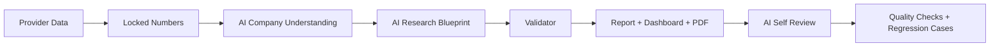

# OpenBB Company Research Tool v5.0
# Rust-Powered AI-Led Company Research Engine

Rust 驱动、AI 主导的公司研究引擎。

An AI-led company research assistant, not a stock picker.

## English Product Overview

OpenBB Company Research Tool v5.0 helps users understand what a company is, how it makes money, where cash comes from and goes, what the data supports, and what still needs manual verification.

It does not produce buy/sell/hold recommendations, target prices, or trading signals.

### Why v5 Exists

Earlier Python workflows were useful, but the main report path was too rule/template driven: data was classified first, a template report was assembled, and AI was used late in the process.

v5 changes the order of authority:

```text
Earlier workflow: Data -> Rule/template profile -> Template report -> AI patch
v5 workflow: Data -> Locked numbers -> AI company understanding -> AI research blueprint -> Validator -> Report -> AI self-review
```

The point is simple: the system must understand the company before writing the report.

### Architecture



### Responsibility Split

| Layer | Responsibility |
| --- | --- |
| Rust | CLI, pipeline orchestration, cache, validation, batch runner, report/dashboard rendering, pack building |
| Python | OpenBB/yfinance bridge, AKShare provider, Tushare path, Baostock path |
| AI | company understanding, financial interpretation, money flow, research blueprint, chart/table explanation, self-review |
| Validator | locked-data boundary, unsupported claims, forbidden advice, AI provenance, visual lint, quality gate |

Templates only organize the surface. They do not invent the company identity, thesis, valuation frame, risks, or next checks.

## 中文产品说明

OpenBB Company Research Tool v5.0 是一个 AI 主导的公司研究引擎。它帮助用户理解：公司是什么、靠什么赚钱、钱从哪里来又去了哪里、当前数据能支持什么判断、还有哪些内容必须人工核查。

它不是荐股工具，不给买入、卖出、持有建议，不给目标价，也不预测短期股价。

### 为什么需要 v5

旧版 Python 流程能生成结构化报告，但主链路还是偏规则和模板：先分类，再套报告，AI 往往只是在后面补一层解释。这样容易出现一个危险结果：报告看起来完整，但公司框架可能从一开始就是错的。

v5 把顺序改掉：

```text
旧流程：数据 -> 规则/模板分类 -> 模板报告 -> AI 补丁
v5：数据 -> 锁定数字 -> AI 理解公司 -> AI 研究蓝图 -> Validator -> 报告 -> AI 自检
```

一句话：先认清公司，再写报告。

### v5 分工

| 层 | 负责什么 |
| --- | --- |
| Rust | CLI、流程编排、缓存、校验、批量、报告/dashboard 渲染、打包 |
| Python | OpenBB/yfinance、AKShare、Tushare、Baostock 数据适配 |
| AI | 公司理解、财报解释、资金流、研究蓝图、图表/表格解释、自我复核 |
| Validator | 锁定数据边界、unsupported claims、禁止投资建议、AI 来源证明、visual lint、质量闸门 |

模板只负责排版和结构，不负责替 AI 发明结论。

## Quick Start

Primary entry point: `research-rs`.

```bash
source "$HOME/.cargo/env"
cargo run --manifest-path research-rs/Cargo.toml -p research-rs -- --help
```

Run AAPL with local fallback analysis:

```bash
cargo run --manifest-path research-rs/Cargo.toml -p research-rs -- run AAPL \
  --ai local \
  --run-id demo_aapl_local
```

Run RKLB with a real OpenAI API call:

```bash
cargo run --manifest-path research-rs/Cargo.toml -p research-rs -- run RKLB \
  --ai compact \
  --require-external-ai \
  --no-ai-cache \
  --run-id demo_rklb_external
```

Run a China A-share company:

```bash
cargo run --manifest-path research-rs/Cargo.toml -p research-rs -- run 600519.SH \
  --market cn \
  --provider akshare \
  --ai local \
  --run-id demo_600519
```

### Optional A-share Provider Packages

Main CI does not require AKShare, Tushare, Baostock, provider tokens, or live financial-network access. For fuller local A-share provider coverage, install the optional provider set:

```bash
python3 -m venv .venv
source .venv/bin/activate
python3 -m pip install -r requirements-providers.txt
```

or:

```bash
python3 -m pip install akshare baostock tushare
```

Provider source labels are explicit:

- `akshare_package`: AKShare is installed and an AKShare endpoint was called.
- `tushare_package`: Tushare is installed, `TUSHARE_TOKEN` is set, and Tushare was called.
- `baostock_package`: Baostock is installed and Baostock was called.
- `eastmoney_public`: public Eastmoney endpoints were used through the A-share fallback adapter.

`eastmoney_public` is real public provider data, not mock data, but it is not a guaranteed official data contract. Important values should still be checked against exchange filings or company reports.

## How to Verify Real OpenAI API Usage

Do not infer real AI usage from polished writing. Check the run artifact:

```text
reports/TICKER/runs/RUN_ID/metadata/ai_usage.json
```

The key fields are:

- `external_ai_used`
- `local_mock_used`
- `new_external_ai_calls`
- `cache_hits`
- `model`
- `tasks`

Example from a verified external run:

```json
{
  "external_ai_used": true,
  "local_mock_used": false,
  "new_external_ai_calls": 4,
  "cache_hits": 0,
  "model": "gpt-4.1-mini"
}
```

If `external_ai_used=false`, the report is not a full external OpenAI analysis. It may be local fallback, skipped AI, or cache-only output. Reports and dashboards must show that boundary.

## v5 Sample Gallery

Samples are product-surface examples, not investment recommendations. Always inspect each sample's `metadata/ai_usage.json` before treating it as external AI analysis.

| Company | Market | AI Source Label | Report | Dashboard | AI Usage | Company Understanding | Blueprint | Self Review |
| --- | --- | --- | --- | --- | --- | --- | --- | --- |
| AAPL | US | local fallback sample | [report](reports/samples/AAPL/report/AAPL_research_report.md) | [dashboard](reports/samples/AAPL/dashboard.html) | [ai_usage](reports/samples/AAPL/metadata/ai_usage.json) | [company_understanding](reports/samples/AAPL/metadata/company_understanding.json) | [blueprint](reports/samples/AAPL/metadata/research_blueprint.json) | [self_review](reports/samples/AAPL/self_review/ai_self_review.md) |
| RKLB | US | external OpenAI run | [report](reports/RKLB/runs/manual_verify_rklb_real/report/RKLB_research_report.md) | [dashboard](reports/RKLB/runs/manual_verify_rklb_real/dashboard.html) | [ai_usage](reports/RKLB/runs/manual_verify_rklb_real/metadata/ai_usage.json) | [company_understanding](reports/RKLB/runs/manual_verify_rklb_real/metadata/company_understanding.json) | [blueprint](reports/RKLB/runs/manual_verify_rklb_real/metadata/research_blueprint.json) | [self_review](reports/RKLB/runs/manual_verify_rklb_real/self_review/ai_self_review.md) |
| GOOGL | US | local fallback sample | [report](reports/samples/GOOGL/report/GOOGL_research_report.md) | [dashboard](reports/samples/GOOGL/dashboard.html) | [ai_usage](reports/samples/GOOGL/metadata/ai_usage.json) | [company_understanding](reports/samples/GOOGL/metadata/company_understanding.json) | [blueprint](reports/samples/GOOGL/metadata/research_blueprint.json) | [self_review](reports/samples/GOOGL/self_review/ai_self_review.md) |
| CAT | US | local fallback sample | [report](reports/samples/CAT/report/CAT_research_report.md) | [dashboard](reports/samples/CAT/dashboard.html) | [ai_usage](reports/samples/CAT/metadata/ai_usage.json) | [company_understanding](reports/samples/CAT/metadata/company_understanding.json) | [blueprint](reports/samples/CAT/metadata/research_blueprint.json) | [self_review](reports/samples/CAT/self_review/ai_self_review.md) |
| AMD | US | local fallback sample | [report](reports/samples/AMD/report/AMD_research_report.md) | [dashboard](reports/samples/AMD/dashboard.html) | [ai_usage](reports/samples/AMD/metadata/ai_usage.json) | [company_understanding](reports/samples/AMD/metadata/company_understanding.json) | [blueprint](reports/samples/AMD/metadata/research_blueprint.json) | [self_review](reports/samples/AMD/self_review/ai_self_review.md) |
| 600519.SH | CN A-share | local fallback sample | [report](reports/samples/600519.SH/report/600519.SH_research_report.md) | [dashboard](reports/samples/600519.SH/dashboard.html) | [ai_usage](reports/samples/600519.SH/metadata/ai_usage.json) | [company_understanding](reports/samples/600519.SH/metadata/company_understanding.json) | [blueprint](reports/samples/600519.SH/metadata/research_blueprint.json) | [self_review](reports/samples/600519.SH/self_review/ai_self_review.md) |
| 000001.SZ | CN A-share | local fallback sample | [report](reports/samples/000001.SZ/report/000001.SZ_research_report.md) | [dashboard](reports/samples/000001.SZ/dashboard.html) | [ai_usage](reports/samples/000001.SZ/metadata/ai_usage.json) | [company_understanding](reports/samples/000001.SZ/metadata/company_understanding.json) | [blueprint](reports/samples/000001.SZ/metadata/research_blueprint.json) | [self_review](reports/samples/000001.SZ/self_review/ai_self_review.md) |

Sample gallery index:

```text
reports/samples/index.html
```

## Output Structure

```text
reports/TICKER/runs/RUN_ID/
  report/
  dashboard.html
  metadata/
  ai/
  audit/
  self_review/
  charts/
  raw/
```

Useful first files:

- `report/*_research_report.md`
- `dashboard.html`
- `metadata/ai_usage.json`
- `metadata/company_understanding.json`
- `metadata/research_blueprint.json`
- `metadata/evidence_map.json`
- `audit/validator_report.md`
- `self_review/ai_self_review.md`

## Report Structure

1. Report Status
2. Company Identity
3. Business Model
4. Money Flow
5. Financial Statement Interpretation
6. AI Research Blueprint
7. Valuation Frame
8. Risks and Red Flags
9. Data Gaps
10. AI Self Review
11. Next Checks
12. Appendix

## Dashboard, PDF, and Charts

Standard runs attempt to produce a Markdown report, static `dashboard.html`, PDF export when local tooling is available, core charts or data-gap cards, chart explanations, table explanations, and visual lint reports.

Current limitations are explicit:

- PDF may be unavailable if local export tooling is missing.
- PDF status must not pass if the output is blank or missing.
- Charts must answer a research question; missing data should become a data-gap card.
- Dashboard is meant to be a product surface, not just a list of files.

## Quality System

v5 treats quality as an artifact, not a vibe. Runs may include:

- AI provenance in AI JSON outputs
- `metadata/ai_usage.json`
- `metadata/evidence_map.json`
- `metadata/data_inventory.json`
- `audit/data_inventory_report.md`
- `audit/visual_lint_report.md`
- `audit/chart_table_quality_report.md`
- content quality summaries
- training cases
- regression hard cases

The quality layer is designed to catch polished but weak reports: wrong company frame, hallucinated revenue engines, missing money-flow analysis, unsupported numeric claims, generic chart explanations, vague next checks, and local fallback being mistaken for external AI.

## Supported Markets

| Market | Path | Notes |
| --- | --- | --- |
| US | OpenBB/yfinance bridge | Coverage depends on local provider availability and upstream fields. |
| China A-share | AKShare package, Tushare path, Baostock path, Eastmoney public fallback | Supports tickers such as `600519.SH`, `000001.SZ`, and `300750.SZ`; provider coverage and field completeness can vary. Reports disclose package/fallback source, adapter, mock flag, limitations, and missing fields. |

A-share reports should use the correct accounting context: RMB units, operating revenue, net profit attributable to parent, adjusted net profit where available, operating cash flow, monetary cash, interest-bearing debt, receivables, inventory, R&D expense, asset-liability ratio, and ROE.

### 可选 A 股 Provider 依赖

主 CI 不强制安装 AKShare、Tushare、Baostock，也不依赖外部金融数据网络。要在本地启用更完整的 A 股 provider 能力，可以安装可选依赖：

```bash
python3 -m venv .venv
source .venv/bin/activate
python3 -m pip install -r requirements-providers.txt
```

A 股数据源标签必须看清楚：

- `akshare_package`：实际安装并调用了 AKShare。
- `tushare_package`：实际安装并调用了 Tushare，且 `TUSHARE_TOKEN` 可用。
- `baostock_package`：实际安装并调用了 Baostock。
- `eastmoney_public`：使用东方财富公开接口 fallback。

`eastmoney_public` 是真实公开数据，不是 mock；但它不是稳定官方数据契约，重要数字仍应和交易所公告或公司年报交叉核验。

## Limitations

- Not investment advice.
- No buy/sell/hold recommendation.
- No target price.
- Provider coverage may be incomplete.
- AI may be wrong even when the external API call succeeds.
- Human review is required for serious decisions.
- local/mock fallback is not full external AI analysis.
- Cache hits are not new external API calls.
- A-share coverage depends on provider availability and field quality.

## Roadmap

| Stage | Scope |
| --- | --- |
| v5 alpha | Rust pipeline, provider bridge, AI-led reports, static dashboard, PDF status, visual/content lint, hard regression cases |
| v5.1 | Streamlit workbench, portfolio research notebook, advanced charts |
| v5.2 | React dashboard, more markets, richer quote context |
| P3 deferred | real trading, broker execution, automatic order placement |

## Legacy

Earlier v2-v4 Python workflows remain available for compatibility. See [docs/history_v2_v4.md](docs/history_v2_v4.md).

## 免责声明

本项目生成的是供复核的一轮研究材料。它可以帮助整理公司理解、资金流、数据证据、风险、数据缺口和下一步核查，但不能替代尽调、审计文件、监管披露、专业建议或人的判断。

## Disclaimer

This project generates first-pass research material for review. It can help structure company understanding, money flow, evidence, risks, data gaps, and follow-up checks. It cannot replace due diligence, audited filings, regulatory disclosures, professional advice, or human judgment.
