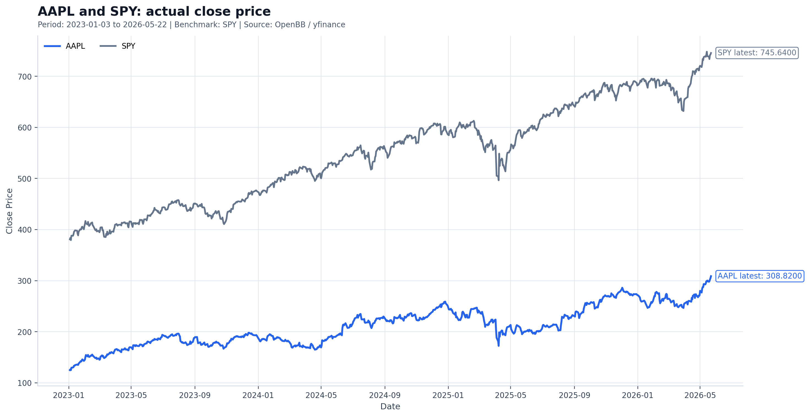
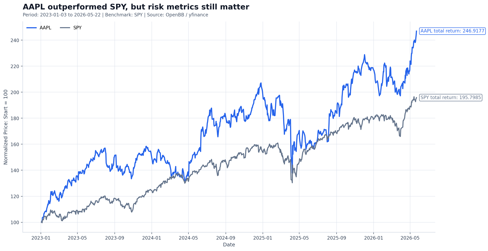
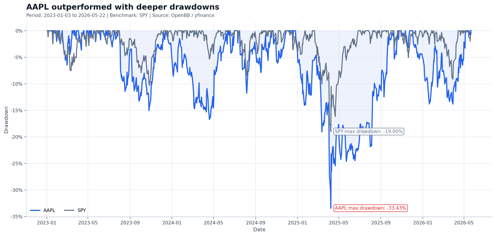
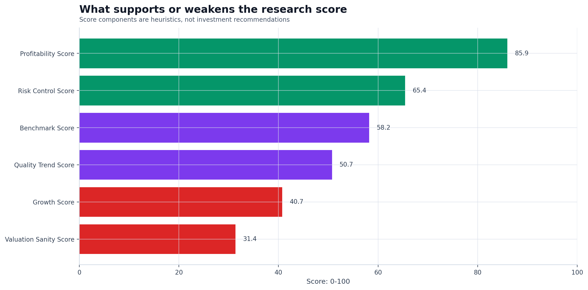
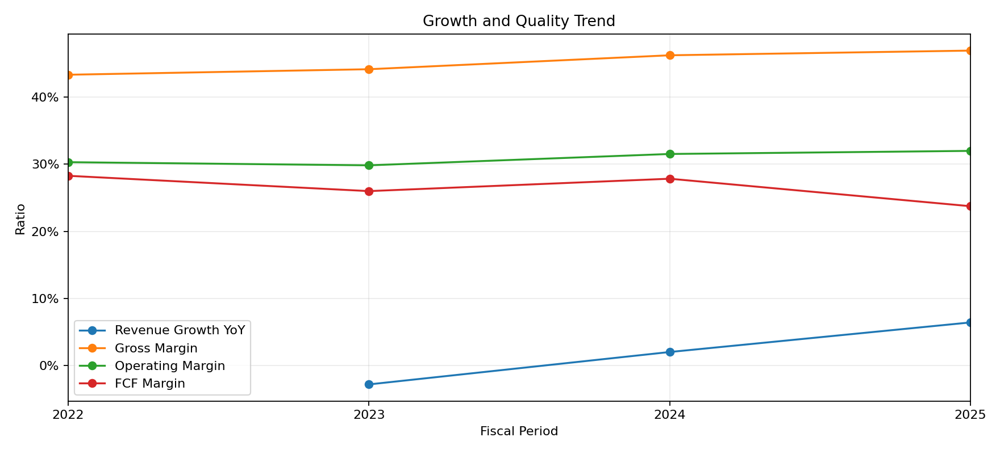
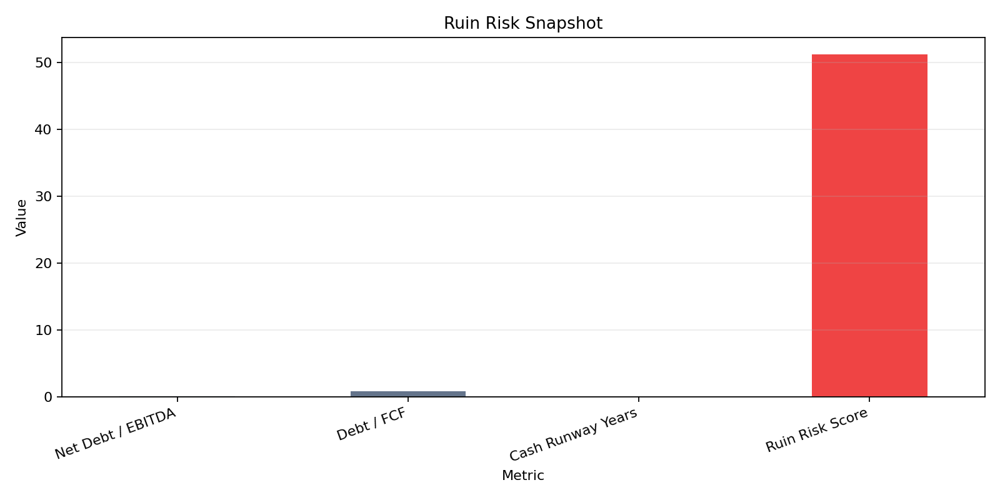

# openbb-company-research-tool

A thesis-driven, asset-aware first-pass equity research workflow generator.

A Python-based company research workflow for turning public market data into structured, archived, and reviewable research reports.

It is built for first-pass company research, not for buy/sell decisions.

v4.3 turns the project into an asset-aware workflow. The report first builds an asset profile, selects a matching research frame, patches interpretation blocks when the profile and wording disagree, and exposes uncertainty when the framework is incomplete.

> Locked data. Asset-aware routing. Editable interpretation. Traceable reasoning. Structured uncertainty.

This tool helps retail investors answer a few basic but important questions before getting emotional about a stock:

- What does the company actually do?
- How has it performed against a benchmark?
- Is the business growing with quality?
- Are there obvious balance-sheet or cash-flow risks?
- Is the data complete enough to trust?
- What should be manually verified before making any judgment?
- What is the long bet, short trigger, market pricing, and kill criteria?
- Is the report using the right research frame for this type of company?

> This is not a stock-picking machine.  
> It is a research workflow designed to reduce false confidence, messy notes, and emotional decision-making.

---

## 30-Second Demo

```bash
openbb-research AAPL --benchmark SPY --start 2023-01-01
```

The tool creates a structured research folder:

```text
reports/AAPL/
├── latest/
│   ├── README.md
│   ├── report/
│   ├── charts/
│   ├── data/
│   ├── audit/
│   ├── ai/
│   ├── dashboard/
│   ├── metadata/
│   └── self_review/
└── runs/
    └── 20260523_..._AAPL_vs_SPY_start_2023-01-01/
```

Every run is automatically archived under `runs/`.

`latest/` is refreshed as a convenient copy of the newest run, so the user can quickly open the most recent report without losing historical outputs.

---

## Sample Report

- [AAPL sample research report](examples/sample_reports/AAPL_sample_research_report.md)
- [AAPL Chinese sample research report](examples/sample_reports/AAPL_sample_research_report_cn.md)
- [Interactive HTML dashboard](examples/sample_reports/AAPL_vs_SPY_interactive_dashboard.html)

Example excerpt:

```text
Research Profile: Mature Compounder
Research Status: Watchlist

One-line Verdict:
AAPL is a steadily growing, cash-generative name that beat SPY on return,
but the risk-adjusted picture is less clean.

Sanity Checks:
No automatic high-risk consistency failure was detected.
Still verify important numbers with primary sources.
```

The generated report starts with a short "How to Read This Report" section, followed by a Beginner Summary table that translates the main evidence into practical research meaning.

---

## v4.3 Asset-Aware Workflow

v4.3 adds the layer that prevents “one template fits every stock.”

The run now follows this shape:

```text
locked data
→ asset profile
→ thesis spine
→ profile-specific report blocks
→ AI interpretation patch
→ lifecycle / company-specificity checks
→ organized report pack
```

Examples:

- AAPL-like companies use mature-compounder logic: margin durability, FCF stability, business mix, capital returns, and premium valuation risk.
- RKLB-like companies use speculative-growth logic: growth quality, burn, runway, dilution, order conversion, and path to profitability.
- INTC-like companies use semiconductor turnaround logic: foundry execution, capex pressure, gross-margin recovery, process roadmap, data-center competitiveness, and free-cash-flow pressure.
- Unknown or data-limited companies are downgraded to screening-only instead of being forced into a known template.

Each run includes:

- `metadata/asset_profile.json`
- `metadata/report_status.json`
- `ai/correction_patch.json`
- `ai/patched_report_blocks.json`
- `ai/patch_diff_log.md`
- `self_review/system_self_review.md`
- `self_review/framework_gap_analysis.md`

The principle is simple: if the system does not understand the company well enough, it must say so.

Generate and zip a report pack:

```bash
openbb-research INTC --both --full --pack --run-id stress_intc_v43
openbb-research pack reports/INTC/runs/stress_intc_v43
```

## v4.4 Batch Evaluation Foundation

v4.4 adds batch evaluation infrastructure so the user does not have to manually inspect one company at a time.

Start with the smoke set:

```bash
openbb-research batch eval_sets/smoke_12.yaml --both --full --pack --max-workers 2 --no-ai
openbb-research batch eval_sets/smoke_12.yaml --ai-review-failures --max-ai-reviews 5 --resume
```

Then, only after the smoke run is stable, run the broad set deterministically:

```bash
openbb-research batch eval_sets/broad_200.yaml --both --full --pack --max-workers 2 --no-ai
openbb-research batch eval_sets/broad_200.yaml --ai-review-failures --max-ai-reviews 40 --resume
```

`broad_200.yaml` is an evaluation set, not something that should be run casually with full AI review. Batch mode defaults toward deterministic lint and compact failure review to control credit usage.

## Batch Evaluation Output

Batch runs write to `reports/batch_runs/<batch_id>/`.

- `batch_summary.md`: human-readable dashboard for the whole batch
- `batch_summary.csv` / `batch_summary.json`: machine-readable batch status
- `failures.md`: failure review report with error type, reason, and next action
- `warnings.md`: warning-level ticker review
- `profile_distribution.md`: asset-profile coverage across the batch
- `failure_type_distribution.md`: repeated failure modes
- `training_cases_generated.jsonl`: local system-training cases; not fine-tuning
- `credit_usage_estimate.md`: AI / credit usage and compact-review rules
- `ai_review_summary.md`: compact review scope and reviewed tickers

The intended review flow is:

1. Open `batch_summary.md`.
2. Inspect `failures.md`.
3. Check generated training cases for repeated failure modes.
4. Convert repeated deterministic failures into tests and code fixes before spending AI credits.

## v4 Workflow Gates and Report Experience

v4.2 keeps the four-gate workflow:

- Data Audit Gate
- Risk Method Gate
- AI Analyst Review Gate
- Language Lint Gate

Report metadata and logs expose:

- `DATA_AUDIT_STATUS`
- `RISK_METHOD_STATUS`
- `AI_ANALYST_REVIEW_STATUS`
- `LANGUAGE_LINT_STATUS`
- `OVERALL_REPORT_STATUS`
- `price_label_sanity_check.md`
- `ai_correction_log.md`
- `language_lint_report.md`

The report does not pretend a weak input passed. If a gate produces a warning or failure, the report exposes it.

v4.2 also rewrites the reading experience:

- Chinese and English reports are separated by default.
- Chinese reports use Chinese status cards and localized metric labels.
- Every chart includes what it shows, what the report reads from it, and how not to misread it.
- Key questions are answered with answer, evidence, and boundary instead of being left as bare prompts.

---

## Charts

### Actual Close Price

Raw closing prices for the stock and benchmark.

Useful for checking absolute price levels, gaps, and overall trend shape.

Each generated report includes a short note explaining how to read the chart and what the chart does not prove.



### Normalized Performance

Both assets start at 100, making relative performance easier to compare.



### Drawdown

Shows how far each asset has fallen from its previous peak.



### Research Score Components

Breaks down what supports or weakens the research score.



### Growth Quality Trend

Tracks revenue growth, margin quality, and free-cash-flow conversion.



### Ruin Risk

Separates normal price volatility from deeper business fragility such as leverage, weak cash flow, or limited cash runway.



---

## What v4.0 Improves

| Problem | v4.0 Response |
| --- | --- |
| Reports can look precise without showing source lineage | Adds `data_audit.md` and `data_audit.csv` |
| AI can become a generic summary writer | Adds bounded `ai_correction_log.md` with answerability checks |
| Risk metrics can become black boxes | Adds Risk Metric Methodology and method status |
| Chart labels can mislead if they do not match source data | Adds Price Label Sanity Check |
| AI-style prose can dilute judgment | Adds Language Lint Gate and Research Battle Card |
| English-to-Chinese translation creates unnatural reports | Adds independent Chinese report mode via `--cn` / `--chinese` |

## What v3.0 Improved

| Problem | v3.0 Response |
| --- | --- |
| AI can blur the line between data and opinion | Keeps calculations deterministic and uses AI only as optional review |
| AI output can be hard to test | Uses Chat Completions structured outputs with a Pydantic schema |
| API failures can break workflows | Falls back to a skipped AI Review section without crashing |
| Long-running API calls can feel frozen | Adds Rich terminal status output and an AI review spinner |
| Markdown should not be scraped for AI input | Builds AI payloads from structured `report_data` |

## What v2.1 Improved

| Problem | v2.1 Response |
| --- | --- |
| Finance terms can intimidate beginners | Adds plain-English meaning under major report sections |
| Scores can be mistaken for buy/sell signals | Adds an explicit beginner warning under Research Score |
| Charts can be misread as proof | Adds chart-reading notes explaining what each chart shows and does not show |
| Metric definitions were scattered | Adds [docs/metric_guide.md](docs/metric_guide.md) |
| Reports could still feel like metric dumps | Adds a Beginner Summary table and clearer next-step research prompts |

## What v2.0 Improved

| Problem | v2.0 Response |
| --- | --- |
| Static PNG charts are hard to inspect | Adds Plotly interactive HTML dashboard |
| Historical drawdown can understate business risk | Adds balance-sheet and cash-flow risk checks |
| One-size-fits-all scoring can be misleading | Adds sector/lifecycle-aware scoring weights |
| Data warnings were too passive | Adds sanity checks with severity, finding, and action |
| Users may forget to archive reports | Archives every run by default |
| Reports lacked a clear review workflow | Adds structured report sections and manual verification prompts |
| Generic analysis ignores personal leverage risk | Adds optional margin stress testing |

---

## Core Features

- Benchmark comparison against `SPY`, `VOO`, `QQQ`, or another ticker
- Optional AI Review using OpenAI Chat Completions structured outputs
- Professional Rich-based terminal output with plain-print fallback
- Static PNG charts and Plotly interactive HTML dashboard
- Actual close price, normalized performance, and drawdown views
- Return, volatility, Sharpe, Sortino, Calmar, beta, alpha, tracking error, information ratio, and capture ratios
- Company profile, valuation snapshot, and financial statement summary
- Growth quality and free-cash-flow trend
- Beginner Summary table and plain-English explanations
- Chart-reading notes in generated reports
- Beginner-friendly metric guide
- Balance-sheet and cash-flow risk indicators:
  - Net Debt / EBITDA
  - Debt / FCF
  - Cash runway
  - EBITDA availability
  - Free-cash-flow coverage
- Sanity checks for:
  - missing data
  - short price history
  - currency mismatch
  - free-cash-flow inconsistency
  - fund-like instruments
- Category-aware scoring for:
  - mature compounders
  - speculative growth companies
  - profitable growth companies
  - cyclicals
  - financials
  - ETFs
  - data-limited cases
- Optional personal margin stress test with:
  - `--account-equity`
  - `--margin-loan`
- Optional AI Review controls:
  - `--ai-review`
  - `--ai-model`
  - `--ai-review-depth`
  - `--ai-timeout`
  - `--ai-max-output-tokens`
  - `--no-rich`
- Cross-ticker comparison when multiple symbols are passed

---

## What It Is Not

This project does **not** provide:

- buy or sell recommendations
- price targets
- guaranteed returns
- trading signals
- portfolio allocation instructions
- automated investment decisions

The research score is a heuristic screening score.

It is not a valuation model, prediction model, or investment recommendation.

The AI Review is also not a recommendation. It reviews reasoning quality and missing verification steps using only the generated report data.

---

## Quick Start

```bash
zsh setup_environment.zsh
source ~/.zshrc
cresearch --help
cresearch AAPL --benchmark SPY --start 2023-01-01
```

Manual setup:

```bash
python3 -m venv .venv
source .venv/bin/activate
pip install -r requirements.txt

python scripts/company_research_tool.py AAPL --benchmark SPY --start 2023-01-01
```

Optional AI setup:

```bash
cp .env.example .env
export OPENAI_API_KEY="your_openai_api_key_here"
python scripts/company_research_tool.py AAPL --ai-review
```

---

## Usage

```bash
# Basic company research
cresearch AAPL

# Compare multiple tickers
cresearch AAPL TSLA RKLB

# Use a growth-heavy benchmark
cresearch NVDA MSFT --benchmark QQQ

# Compare one stock against another
cresearch TSLA --benchmark AAPL --start 2020-01-01

# Custom risk-free rate
cresearch AAPL --risk-free-rate 0.04

# Optional personal margin stress test
cresearch AAPL --account-equity 100000 --margin-loan 25000

# Optional AI review
cresearch AAPL --ai-review

# Deeper AI review with explicit model
cresearch RKLB --ai-review --ai-review-depth deep --ai-model gpt-4o-mini

# Plain terminal output
cresearch AAPL --no-rich

# Custom run folder
cresearch AAPL --run-id thesis_check_2026_05_23
```

---

## Report Structure

Each report follows a repeatable research workflow:

1. Boundary
2. One-line Verdict
3. How to Read This Report
4. Key Takeaways
5. Beginner Summary
6. Data Confidence and Sanity Checks
7. Company Profile
8. Price vs Benchmark
9. Growth and Quality Summary
10. Ruin Risk
11. Business Model and Cash Flow
12. Personal Margin Stress
13. Valuation Snapshot
14. Research Score
15. AI Review, when requested
16. Manual Verification
17. What to Check Next
18. Final Research Questions

See [docs/report_structure.md](docs/report_structure.md) for the report flow and [docs/metric_guide.md](docs/metric_guide.md) for plain-English metric definitions.

---

## Data Sources

- OpenBB
- OpenBB yfinance provider
- yfinance

Free and public financial data can be delayed, incomplete, inconsistent, or wrong.

For serious decisions, key numbers should be verified with:

- SEC filings
- company investor relations pages
- earnings releases
- official financial statements

---

## Setup Note

`setup_environment.zsh` creates a `cresearch` wrapper pointing to the current project folder.

If you move the project folder, rerun:

```bash
zsh setup_environment.zsh
```

---

## License

MIT License.
