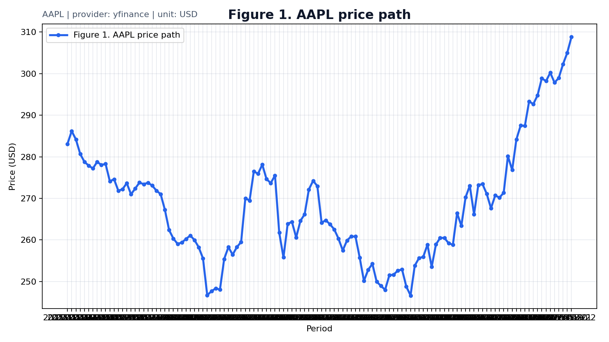
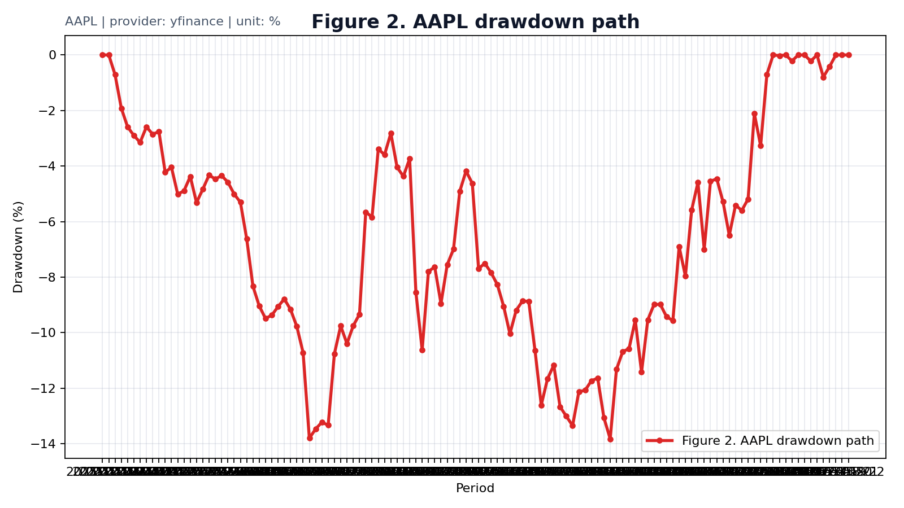
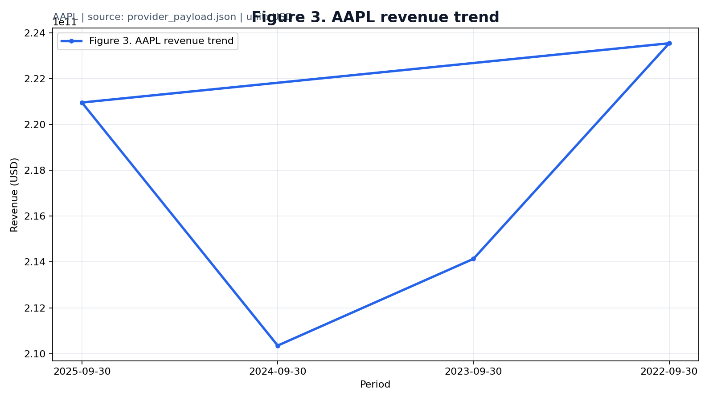
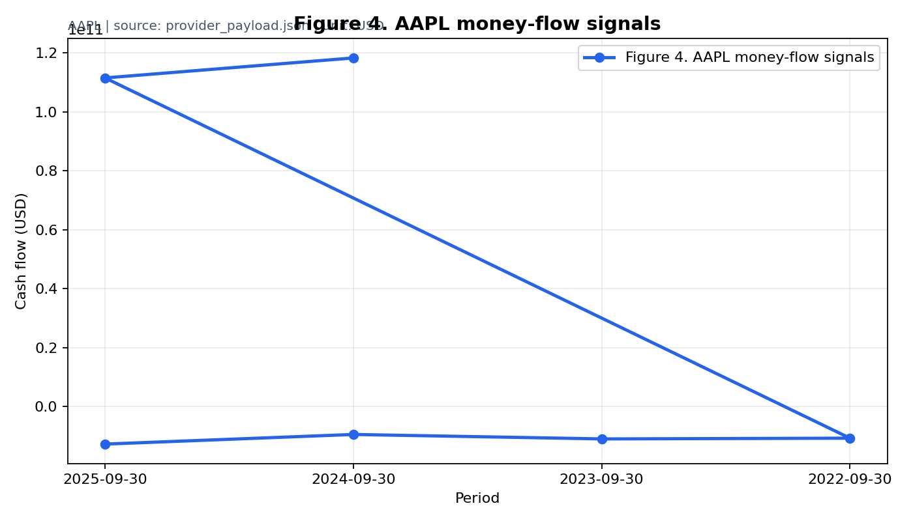
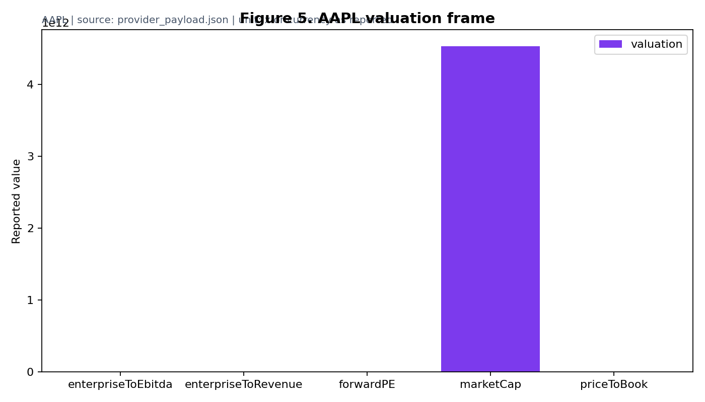

# AAPL Company Research Report

> Version: v5.0  
> Company: Apple Inc.  
> Market: US  
> Provider: yfinance  
> Status: PASS  
> AI Confidence: MEDIUM  
> Research Frame: Mature Consumer Technology Compounder  
> Human Review Required: false  
> Note: This report is for first-pass research only. It is not investment advice.

## Table of Contents

1. Report Status
2. Company Identity
3. Business Model
4. Money Flow: Where Money Comes From and Where It Goes
5. Financial Statement Interpretation
6. AI Research Blueprint
7. Valuation Frame
8. Risks and Red Flags
9. Data Gaps and Unsupported Claims
10. AI Self Review
11. Next Checks
12. Charts and Evidence
13. Appendix: Locked Data

## 1. Report Status

| Item | Value |
|---|---|
| Overall status | PASS |
| Provider status | PASS |
| Visual lint | PASS |
| AI mode | compact |
| AI calls | 0 |
| Cache hits | 0 |
| Human review required | false |

The status separates locked data availability from interpretation confidence. A warning means the report can be useful as a screening memo, but the unsupported sections need human review.

Table 1. Research status snapshot  
Unit: status / text  
Source: metadata/report_status.json  
How to read this table: use it to decide whether this report is usable as a first-pass memo or needs manual review.

## 2. Company Identity

**Identity:** Apple Inc. is best treated as Mature Consumer Technology Compounder based on the locked provider profile and financial context.

**Correct research frame:** Mature Consumer Technology Compounder

**What this company is not:**  
- bank
- biotech pipeline
- semiconductor seller

## 3. Business Model

The research frame is Mature Consumer Technology Compounder. The report should explain how the company earns money before interpreting valuation.

Revenue engines currently identified:

- hardware products
- services ecosystem
- installed base monetization

Profit pool:

Profit pool assessment should focus on the economics implied by Mature Consumer Technology Compounder, not a generic template.

## 4. Money Flow: Where Money Comes From and Where It Goes

Table 2. Money flow summary  
Unit: text  
Source: provider_payload.json and financial_interpretation.json  
How to read this table: each row links a money-flow signal to why it matters.

| Flow | Signal | Unit | Why it matters |
|---|---|---|---|
| Research frame | Mature Consumer Technology Compounder | frame | Controls which metrics matter |
| Money source | Money comes from operating revenue when available, operating cash flow if positive, and financing when operating cash is insufficient. | text | Shows whether operations or financing matter |
| Money use | Money goes to operating costs, reinvestment, R&D, capex, and financing obligations when present. | text | Shows reinvestment and cash pressure |

**Where money comes from:** Money comes from operating revenue when available, operating cash flow if positive, and financing when operating cash is insufficient.

**Where money goes:** Money goes to operating costs, reinvestment, R&D, capex, and financing obligations when present.

This matters because growth is not automatically valuable. The report needs to distinguish operating cash generation from financing, reinvestment, R&D, capex, working capital, buybacks, and debt service.

## 5. Financial Statement Interpretation

**Revenue:** Locked data includes latest revenue around 220960000000.0. The report can discuss revenue direction only within provider coverage.

**Margins:** Margin interpretation must use the Mature Consumer Technology Compounder frame and avoid cross-industry shortcuts.

**Cash flow:** Operating cash flow is 111482000000.0; capital expenditure is -12715000000.0. Free cash flow quality depends on the gap between operating cash generation and reinvestment needs.

**Capex / R&D pressure:** Reinvestment pressure should be judged against the company-specific frame, not a one-size-fits-all metric.

**Debt and financing:** Debt-like obligations appear in locked data around 62723000000.0; financing risk should be reviewed in filings.

**Shareholder return quality:** Buybacks and dividends are interpretation topics only when the locked data and company frame support them.

## 6. AI Research Blueprint

**Core thesis:** The central research question is whether the Mature Consumer Technology Compounder frame is supported by locked data and company-specific evidence.

**Asset profile:** Mature Consumer Technology Compounder

**Secondary profile:** Hardware / Services ecosystem

Must analyze:

- business model
- money flow
- industry-specific drivers

Must not analyze as core:

- confident complete industry conclusion

Key questions:

- What does this company actually sell?
- Which metrics are industry-specific?
- What data is missing?

## 7. Valuation Frame

Screening-only until industry-specific valuation drivers are verified.

The report does not provide a target price, buy/sell recommendation, or short-term price prediction.

## 8. Risks and Red Flags

- framework uncertainty
- missing industry metrics

## 9. Data Gaps and Unsupported Claims

Data gaps:

- Not available from locked data.

Unsupported claims flagged by AI self-review:

- Not available from locked data.

## 10. AI Self Review

| Check | Status |
|---|---|
| Company understanding | PASS |
| Framework fit | PASS |
| Numeric consistency | PASS |
| Money flow | PASS |
| Final confidence | MEDIUM |

Wrong-framework risks:

- Not available from locked data.

## 11. Next Checks

- Read the latest filing for revenue engines.
- Identify industry-specific KPIs.
- Decide which valuation method is actually suitable.

## 12. Charts and Evidence

### Figure 1. Price / Benchmark Performance

Source: provider_payload.json  
Status: PASS or DATA_GAP

What to look at:
This figure is evidence for the section's main question, not decoration.

What it means:
Read it together with the locked data and the research frame.

What not to overread:
The chart does not predict short-term price movement and does not create a buy/sell signal.

Next check:
Verify the same signal in the latest filing or provider source if it drives the thesis.

### Figure 2. Drawdown / Risk Path

Source: provider_payload.json  
Status: PASS or DATA_GAP

What to look at:
This figure is evidence for the section's main question, not decoration.

What it means:
Read it together with the locked data and the research frame.

What not to overread:
The chart does not predict short-term price movement and does not create a buy/sell signal.

Next check:
Verify the same signal in the latest filing or provider source if it drives the thesis.

### Figure 3. Financial Trend

Source: provider_payload.json  
Status: PASS or DATA_GAP

What to look at:
This figure is evidence for the section's main question, not decoration.

What it means:
Read it together with the locked data and the research frame.

What not to overread:
The chart does not predict short-term price movement and does not create a buy/sell signal.

Next check:
Verify the same signal in the latest filing or provider source if it drives the thesis.

### Figure 4. Money Flow / Cash Flow Bridge

Source: provider_payload.json  
Status: PASS or DATA_GAP

What to look at:
This figure is evidence for the section's main question, not decoration.

What it means:
Read it together with the locked data and the research frame.

What not to overread:
The chart does not predict short-term price movement and does not create a buy/sell signal.

Next check:
Verify the same signal in the latest filing or provider source if it drives the thesis.

### Figure 5. Valuation Frame

Source: provider_payload.json  
Status: PASS or DATA_GAP

What to look at:
This figure is evidence for the section's main question, not decoration.

What it means:
Read it together with the locked data and the research frame.

What not to overread:
The chart does not predict short-term price movement and does not create a buy/sell signal.

Next check:
Verify the same signal in the latest filing or provider source if it drives the thesis.

## 13. Appendix: Locked Data

Table 3. Locked data coverage  
Unit: count / text  
Source: raw/provider_payload.json  
How to read this table: it tells you which locked data exists before relying on interpretation.

| Field | Value |
|---|---|
| Ticker | AAPL |
| Sector | Technology |
| Industry | Consumer Electronics |
| Currency | USD |
| Price points | 260 |
| Income rows | 195 |
| Balance sheet rows | 200 |
| Cash-flow rows | 200 |

